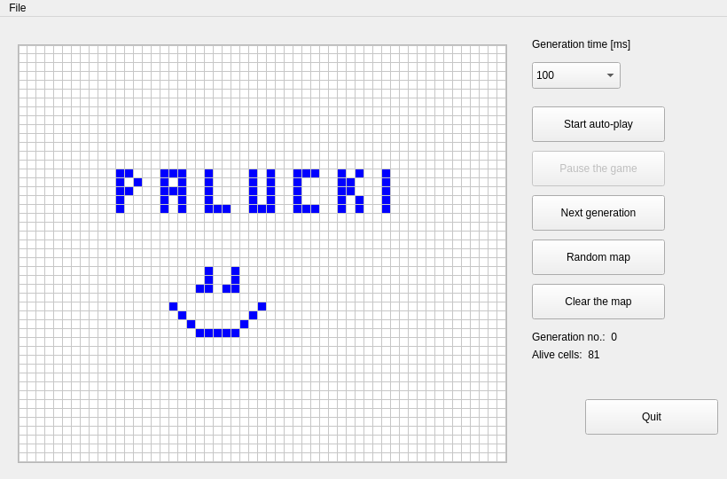

# Game of life

Simple simulation of [Conway's game of life](https://en.wikipedia.org/wiki/Conway's_Game_of_Life) written in C++ with Qt.
Features:
* auto-play and single step modes
* random and manual map creation
* loading and saving map (file in *gl format)
* alive cells, generation counters

## Screenshots



### Prerequisites

You need to have Qt >= 5 installed and configured to run the project.

### Installing

Simply clone / download the repository and build it.


```
git clone git@github.com:palucki/game-of-life.git
cd game-of-life/src
qmake
make
```

After you sucessfully build the project, run it by typing

```
./GameOfLife
```

## Built With

* [Qt](https://www.qt.io/) - Qt Framework

## Author

* **Piotr Pałucki** - [palucki](https://palucki.github.io)

## License

As per Qt requirements, any usage is allowed under (L)GPL v3 license.
